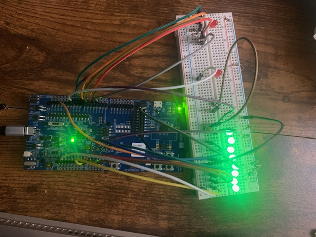

# The KeyBird

A split, ortholinear keyboard that addresses the limitations and inefficiencies of standard keyboards.

The initial build will support BLE only, but I plan to support both in the future, allowing the user (presumably just me), to choose between the convenience of wireless, or the almost imperceptible performance improvements offered by USB.

Built on Zephyr RTOS using NRF series microcontrollers. 

## Protoypes
### KeyBird P1
Used an NRF53 development board connected to a little breadboard ciruit to test the functionality of the key matrix. The LEDs were a visual representation of the keyboard scanning across the rows in the key matrix. The prototype functioned as a BLE peripheral, sending notifications to a computer when the button on the breadboard was pressed. 

### KeyBird P2
The KeyBird P2 refined the design from P1. It implemented a 4 by 4 key matrix on a perfboard, which could be read by an Adafruit NRF52840 Feather. Additionally, it acted as both a BLE peripheral and central, capable of reading key ppresses from a second keyboard, and relaying them to a computer. This is a key function in a split keyboard, since both halves must be synchronized when communicating with a computer. 

### KeyBird P3

The KeyBird P3 will feature two custom PCBs with a split ortholinear layout, horizontally staggered keys, and 5 key thumb pads.

