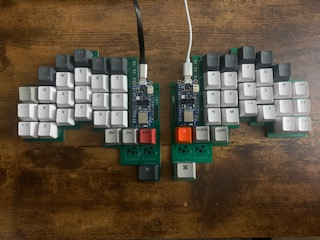
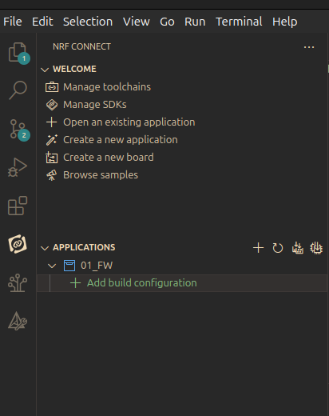
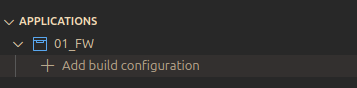
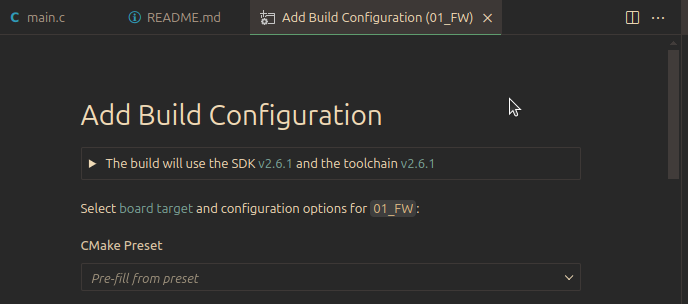

# The KeyBird
The KeyBird is a BLE split keyboard with a vertical stagger and 5 thumb keys. It features hot-swap sockets compatible with any MX switches. The design is inspired by other popular split keyboards such as the [Corne](https://github.com/foostan/crkbd) or [Kinesis keyboards](https://kinesis-ergo.com/?gad_source=1&gclid=CjwKCAiAwaG9BhAREiwAdhv6Y5c0aeCQfguv5zLsIx9gEMnvGuGCnlFAN4PNxmo4kbpMpXuSq_xYTRoC38cQAvD_BwE).
  
  

## Project Status
### Firmware 
- [x] Proof of concept: Single board BLE HID over GATT
- [x] Key matrix
- [x] Multi-role functionality
- [x] Process keypresses from secondary keyboard
- [ ] Improvements based on user experience
### Electronics 
- [x] Proof of concept: Perf board
- [x] Design and order PCBs
- [x] Assemble PCBs
- [ ] Improvements based on user experience 
### Case
- [x] Design case and plate
- [ ] 3D-print case and plate
- [ ] Build a wooden case
### Stretch goals
- [ ] Enable tenting
- [ ] Add NFC pairing capability
- [ ] Add USB option
- [ ] Add RGB LEDs
- [ ] OTA update
- [ ] Keyboard configuration via file upload

### Design Notes (AKA why does it look like that?) 
If you've never plunged down the ergonomic keyboard rabbit hole before, I'll give you a quick breakdown explaining some of the design decisions that went into my keyboard.  
  
**1. Split**  
Splitting a keyboard in half allows your hands and wrists to rest at a more natural and comfortable position  
**2. Ortholinear**   
This is just a fancy way to say that the keys are layed out in vertical columns, unlike typical keyboards, where the keys form horizontal rows, but are vertically staggered. Using vertical columns, especially when those columns are staggered to conform with the length of each finger, provides a more ergnomic typing experience.
**3. Reduced key count**  
Reducing the number of keys enables you to type faster and more efficiently since you do not have to stretch your fingers for hard to reach keys. This is especially helpful for coding, where you have to use symbols like ~ and | more often than most typers. But you might wonder, if you reduce the number of keys, don't you reduct the number of characters you can type? That is where the next design principle comes into play.
**4. Layers**  
A reduced keyboard makes up for its lack of keys by using layers. Layers are changed with the press of a button. When pressing the layer button, the same physical keys will transmit a different character to your PC. The shift key on a normal keyboard functions like this. On a reduced size keyboard, there will be at least one other layer key besides the shift key, enabling the same number of characters to be typed with fewer keys.  
**5. Thumb cluster**  
The thumb cluster solves one of the inefficiences of a standard keyboard, where both of your thumbs are dedicated to a single key. Adding a thumb cluster enables you to press far more keys without increasing how much you have to move your hand. This helps counter balance the reduced key size, while still preventing you from have to stretch and reach to use necessary keys.  
  
## Development requirements  
For hardware development KiCad 8 is used. 

For firmware Development nRF Connect SDK v2.6.1 is required. It can be conveniently used with the NRF Visual Studio Code Extension. More information can be found [here](https://docs.nordicsemi.com/bundle/ncs-latest/page/nrf/installation/install_ncs.html). 

#### Generating first build.  
1. Navigate to the NRF Connect Tab in VS Code.  
  
  
2. Select Add Build Configuration.  
  
  
3. Choose one of the presets. The presets are determined by the CMakePresets.json, but they can be simply be selected in the GUI.    
  

