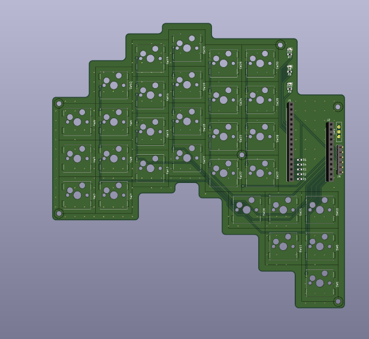
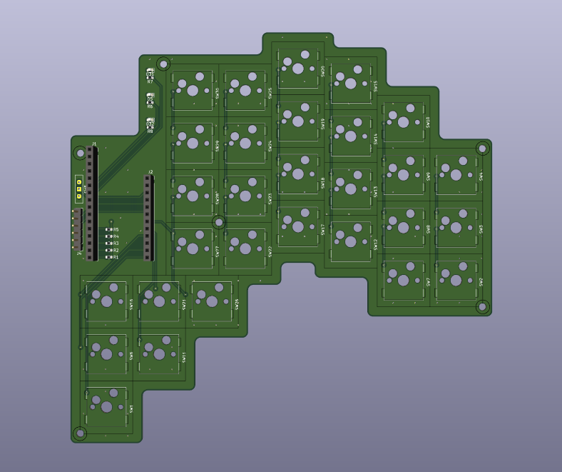
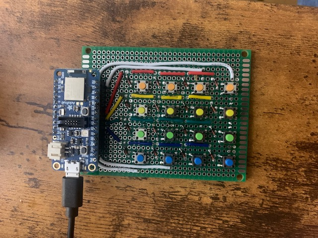

# The KeyBird
The KeyBird is a BLE split keyboard with a vertical stagger and 5 thumb keys. It features hot-swap sockets compatible with any MX switches. The design is inspired by other popular split keyboards such as the [Corne](https://github.com/foostan/crkbd) or [Kinesis keyboards](https://kinesis-ergo.com/?gad_source=1&gclid=CjwKCAiAwaG9BhAREiwAdhv6Y5c0aeCQfguv5zLsIx9gEMnvGuGCnlFAN4PNxmo4kbpMpXuSq_xYTRoC38cQAvD_BwE).

A split, ortholinear keyboard that addresses the limitations and inefficiencies of standard keyboards. 

Built on Zephyr RTOS using an Adafruit NRF52840 Feather. 

## Development requirements  
For firmware Development nRF Connect SDK v2.6.1 is required. It can be conveniently used with the NRF Visual Studio Code Extension. More information can be found [here](https://docs.nordicsemi.com/bundle/ncs-latest/page/nrf/installation/install_ncs.html). 

## Project Status
### Firmware 
- [x] Proof of concept: Single board BLE HID over GATT
- [x] Key matrix
- [x] Multi-role functionality
- [x] Process keypresses from secondary keyboard
- [ ] Improvements based on user experience
### Electronics 
- [x] Proof of concept: Perf board
- [x] Design and order PCBs
- [ ] Assemble PCBs
- [ ] Improvements based on user experience 
### Case
- [ ] Design plate
- [ ] Design and 3D print case
- [ ] Create a wooden case
### Stretch goals
- [ ] Design 
- [ ] Add NFC pairing capability
- [ ] Add USB option
- [ ] Add RGB LEDs
- [ ] OTA update
- [ ] Keyboard configuration via file upload

## Hardware
### KeyBird V1
  
Left hand PCB 
  
  
  
Right hand PCB

## Proof of Concept 
This early design enabled me to develop the firmware and test to make sure the switch matrix worked as expected. I made the proof of concept on a small piece of perf board, with a 4x4 button matrix and an Adafruit NRF52840 Feather. 

