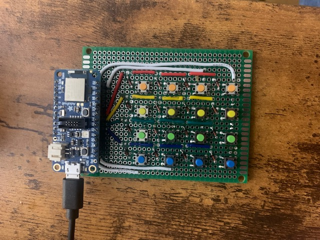

# The KeyBird
The KeyBird is a BLE split keyboard with a vertical stagger and 5 thumb keys. It features hot-swap sockets compatible with any MX switches. The design is inspired by other popular split keyboards such as the [Corne](https://github.com/foostan/crkbd) or [Kinesis keyboards](https://kinesis-ergo.com/?gad_source=1&gclid=CjwKCAiAwaG9BhAREiwAdhv6Y5c0aeCQfguv5zLsIx9gEMnvGuGCnlFAN4PNxmo4kbpMpXuSq_xYTRoC38cQAvD_BwE).

A split, ortholinear keyboard that addresses the limitations and inefficiencies of standard keyboards. 

Built on Zephyr RTOS using an Adafruit NRF52840 Feather. 
## Hardware
### KeyBird V1
 
Left hand PCB 

Right hand PCB

## Proof of Concept 
This early proof of concept designs enabled me to develop the firmware and test to make sure the switch matrix worked as expected. I made the proof of concept on a small piece of perf board, with a 4x4 button matrix and an Adafruit NRF52840 Feather. 

